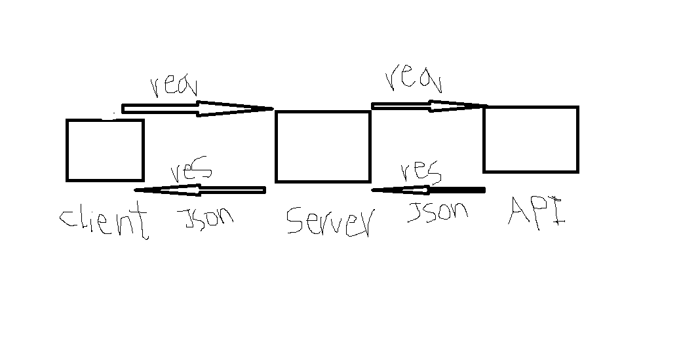
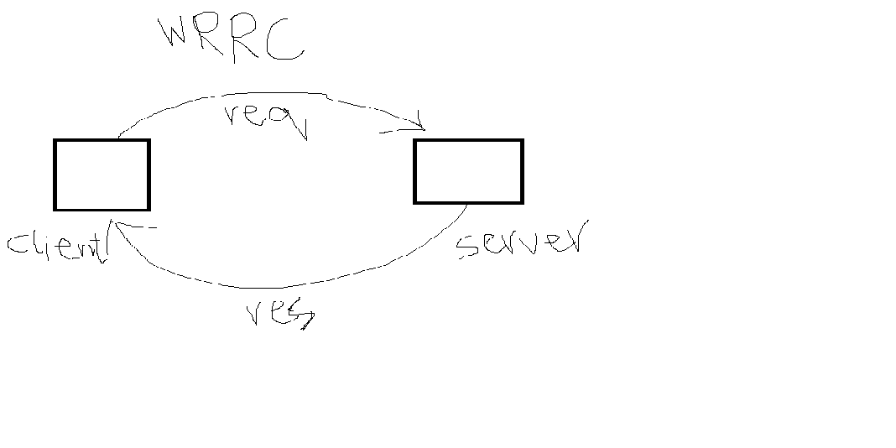
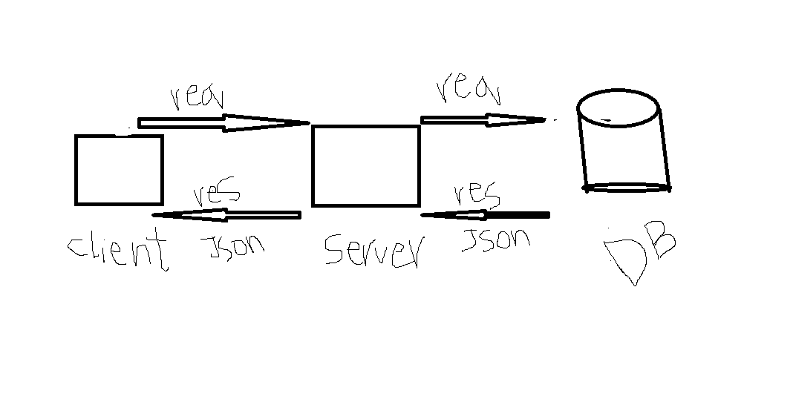
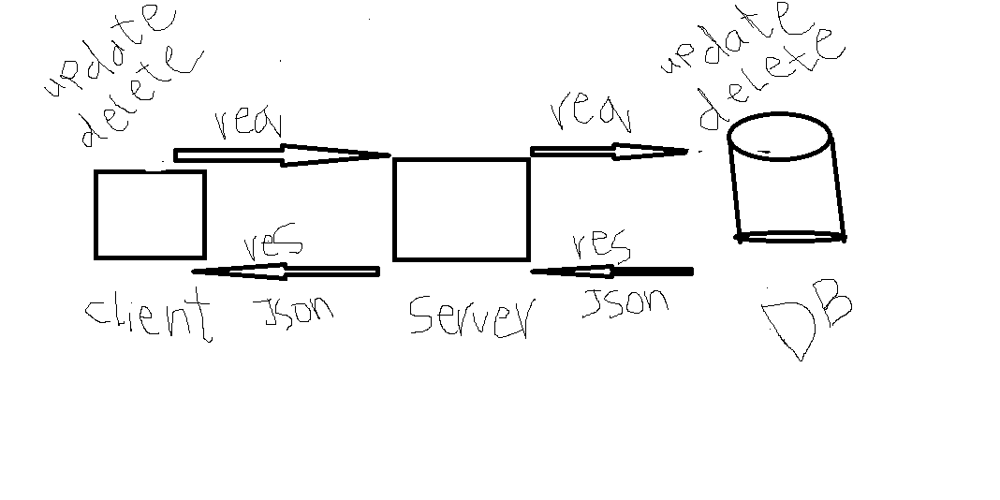

# Movie-Library - 1.0.0

**Author Name**: Samar alazzam

## WRRC

## Overview

## Getting Started
#### Biuld the server
* npm init -y
* create an "server.js" name is optional
* install express package to use it
* run the server using "node server.js" 
* install axios dotenv
* build two routes /trending and /search
* build two routes / addMovie and getMovies
* install package pg
* build three routes / update and delete and get

## Project Features
* express package
* jason data

## What observations or questions do you have about what you’ve learned so far?

### there is a lot of pressure in the dutes
#

## How long did it take you to complete this assignment? And, before you started, how long did you think it would take you to complete this assignment?
### I take three hours
### I think take one hour
